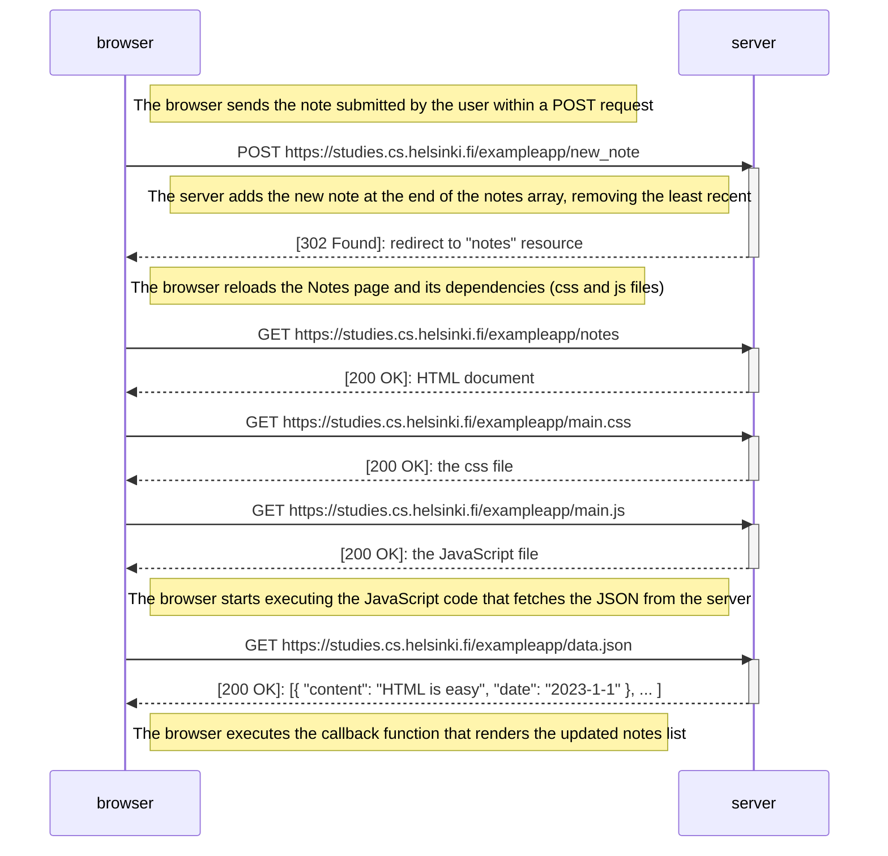

```mermaid
sequenceDiagram
    participant browser
    participant server

    Note right of browser: The browser sends the note submitted by the user within a POST request  
    
    browser->>server: POST https://studies.cs.helsinki.fi/exampleapp/new_note
    activate server
    
    Note left of server: The server adds the new note at the end of the notes array, removing the least recent
    
    server-->>browser: [302 Found]: redirect to "notes" resource
    deactivate server

    Note right of browser: The browser reloads the Notes page and its dependencies (css and js files)
    browser->>server: GET https://studies.cs.helsinki.fi/exampleapp/notes
    activate server
    server-->>browser: [200 OK]: HTML document
    deactivate server

    browser->>server: GET https://studies.cs.helsinki.fi/exampleapp/main.css
    activate server
    server-->>browser: [200 OK]: the css file
    deactivate server

    browser->>server: GET https://studies.cs.helsinki.fi/exampleapp/main.js
    activate server
    server-->>browser: [200 OK]: the JavaScript file
    deactivate server

    Note right of browser: The browser starts executing the JavaScript code that fetches the JSON from the server

    browser->>server: GET https://studies.cs.helsinki.fi/exampleapp/data.json
    activate server
    server-->>browser: [200 OK]: [{ "content": "HTML is easy", "date": "2023-1-1" }, ... ]
    deactivate server

    Note right of browser: The browser executes the callback function that renders the updated notes list
```
