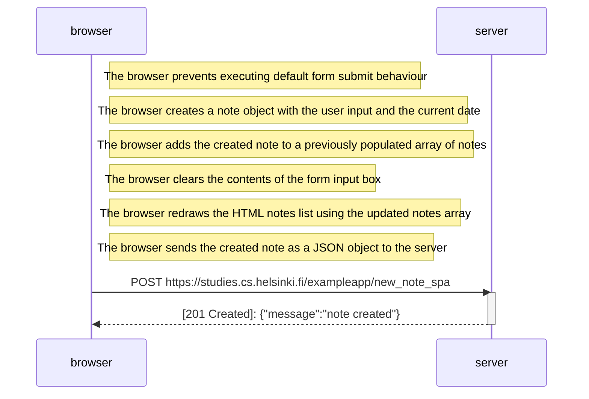

```mermaid
sequenceDiagram
    participant browser
    participant server

    Note right of browser: The browser prevents executing default form submit behaviour

    Note right of browser: The browser creates a note object with the user input and the current date

    Note right of browser: The browser adds the created note to a previously populated array of notes

    Note right of browser: The browser clears the contents of the form input box

    Note right of browser: The browser redraws the HTML notes list using the updated notes array

    Note right of browser: The browser sends the created note as a JSON object to the server

    browser->>server: POST https://studies.cs.helsinki.fi/exampleapp/new_note_spa

    activate server
    server-->>browser: [201 Created]: {"message":"note created"}
    deactivate server
```
